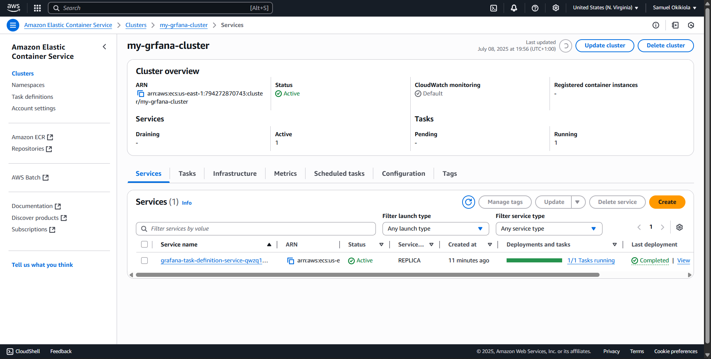
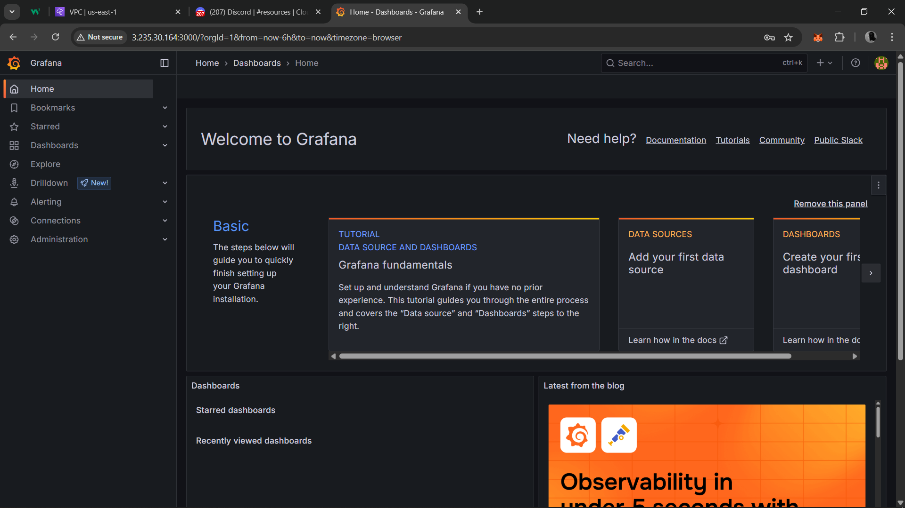

# AWS ECS Grafana Deployment 🚀

This repository documents my experience deploying **Grafana** on **AWS ECS (Fargate)**.  
The goal was to learn containerized deployments on AWS and practice cloud fundamentals.

## 🏗️ Project Overview
- Deployed Grafana using the **official Docker image**: `grafana/grafana:latest`  
- Ran the container in **AWS ECS Fargate**  
- Configured security groups to allow HTTP access (port 3000)  
- Learned about ECS clusters, services, and task management

## 📌 Tools Used
- AWS ECS (Fargate)  
- AWS VPC & Security Groups  
- Grafana Docker image  
- Browser & AWS Console  

## 📸 Screenshots
### 1. ECS Cluster
  
### 2. Task Definition
  
### 3. Security Group (Port 3000 open)
 
### 4. Grafana Sign-up Page 
  
### 5. Grafana Dashboard
  

## 🎯 Purpose
- Practice containerized deployments in the cloud  
- Document my learning journey  

